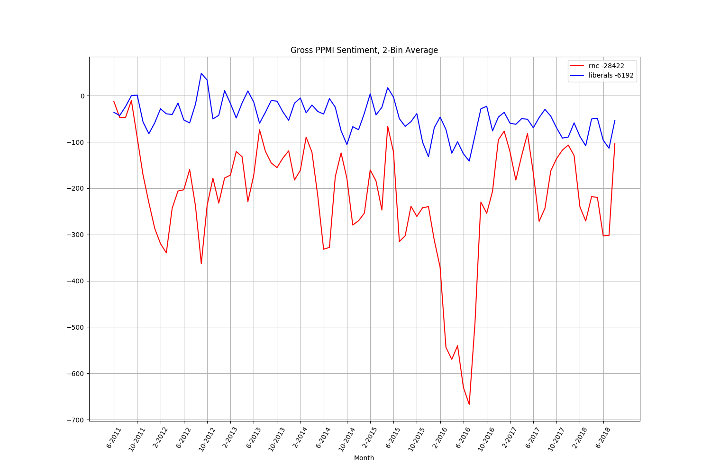

Google News' partisan bias, 6-2011 thru 8-2018, analyzed using Sentinel and ppmi sentiment analysis of all
content referring to either 'democrat' or 'republican' topic terms.

~~~~~~~~~~~~~~~~~~~~~~~~~~~~~~~~~~~~~~~~~~~~~
ABLE/Sentinel 2016 Election Reproduction Data
~~~~~~~~~~~~~~~~~~~~~~~~~~~~~~~~~~~~~~~~~~~~~

This repo contains reproduction data for several analyses of the distribution of partisan/candidate/link
bias of online media content during the 2016 election.

The files prefixed with 'chunk' are pieces of a zip file named 2016_Election_Data.zip,
which contains a dump of all reproduction data and a large collection of visuals for the analyses
detailed in the "Using Textual Analysis to Detect Misinformation and Political Bias.docx" file.

Data reassembly:
	On linux:
		To reassemble the 'chunk' files into the original file, use:
			cat chunk* > 2016_Election_Data.zip
			unzip 2016_Election_Data.zip

	On windows:
		To reassemble the chunk files into the original file, use the 'type' command, listing all of the file parameters, as:
			type chunk_aa chunk_ab chunk_ac chunk_ad chunk_ae chunk_af chunk_ag chunk_ah chunk_ai > 2016_Election_Data.zip

		Then just unzip the file by right-clicking and selecting 'uncompress'/'unzip'.

Data folder contents:
	2016_Election_Data/
		GoogleLinkAnalysis/
			Contains visuals of the link distribution for the input topics in the file names for 2016. These distributions can be reproduced from
			the urls in the "repro_googlenews*" json files in the other folders. 
		GoogleSentimentAnalysis/
			Contains visuals and reproduction data for a long-term sentiment analysis of Google-News.
		Partisan_2016_Analysis/
			Various visuals of content volume, content facebook share volume, sentiment analysis, and reproduction data for multiple online news organizations.
			These analyses were for the partisan topics listed in the file names.
		Trump_Clinton_2016_Analysis/
			The same layout as Partisan_2016_Analysis, but for the leading candidates in the 2016 election, Donald Trump and Hillary Clinton, and the respective
			volume, audience-share, and sentiment biases per these candidates for multiple organizations.

The four root folders are output dumps from automated analyses, so visuals, json reproduction data, and other data have
been dumped into the folder of their respective topical analysis. The json reproduction data are all prefixed by
"repro". These files were stored per-analysis and per-organization, so for example the file "repro_wsj_republican_democrat_unfiltered.json"
contains 2016 web content from the Wall Street Journal, containing topic hits on 'democrat' or 'republican' (and
some other topic terms). The associated "...filtered.json" file contains each file after filtering and text normalization,
as detailed in "Using Textual Analysis to Detect Misinformation and Political Bias". The reproduction json
file directly correspond with the analyses mentioned in the paper. After drilling into the json a bit, each file just
contains a list of 'Headline' objects, containing static fields like headline, description, datetime, share_count, etc.

Disclaimer:
	This dataset is subject to change if errors are found, but has been generated to the highest level of accuracy obtainable.

LICENSE:
	MIT License.

	This data is for academic research, and you are free to use and analyze it as you like, with proper citation. Analysis of publicly-shared 
	content data for the sake of public awareness and research is explicitly protected by Fair Use. The internet is the new
	public square, so if these organizations didn't want their content analyzed, they should not have pushed it into the public
	square. Moreover, their recent political activity foregoes copyright claims, because political speech/content is public speech. As
	citizens, we often no longer consent to consume various content, it is either forced upon us, or influences those around us.
	It is the right of citizens in a free republic to critique and analyze powerful entities, and to determine for themselves whether or
	not the distribution of information favored and pushed by those in power is appropriate to their interests.

